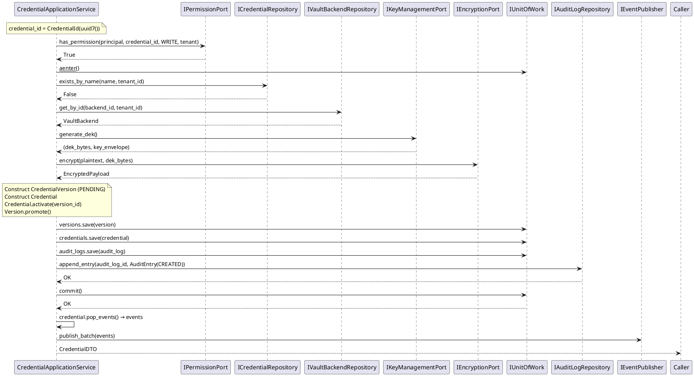
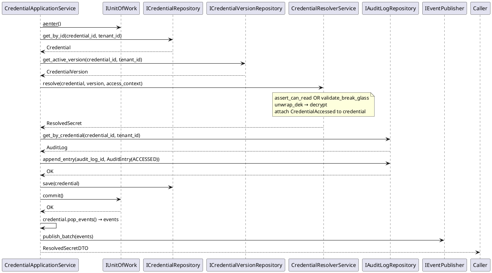
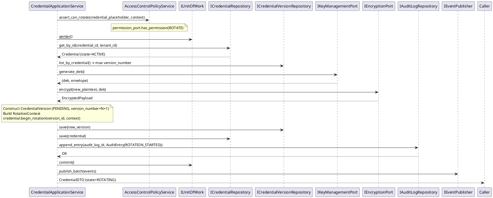
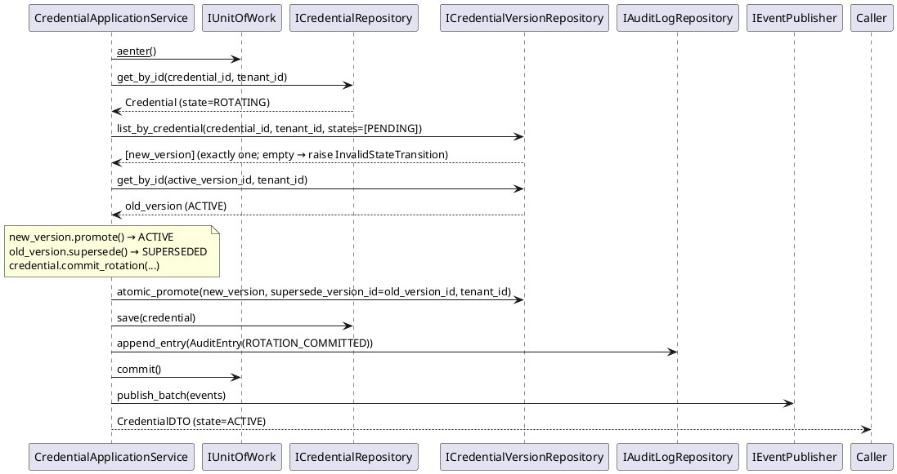

# M25B Implementation Specification — Part 2
## Sections 13–23

---

# 13. Domain Events

## 13.1 Events produced per use case

| Use Case | Domain Events Emitted |
|---|---|
| CreateCredential | `CredentialCreated`, `CredentialVersionCreated` |
| ResolveCredential (normal) | `CredentialAccessed` |
| ResolveCredential (break-glass) | `BreakGlassAccessed` |
| RotateCredential (begin) | `CredentialRotationStarted` |
| CommitRotation | `CredentialRotated` |
| AbortRotation | `RotationAborted` |
| DisableCredential | `CredentialDisabled` |
| EnableCredential | `CredentialEnabled` |
| RevokeCredential | `CredentialRevoked` |
| EmergencyRevoke | `EmergencyRevoked` |
| ExpireCredential | `CredentialExpired` |
| RecoverCredential | `CredentialRecovered` |
| HardDeleteCredential | `CredentialDeleted` |
| RollbackVersion | `VersionRolledBack` |
| UpdateMetadata | `CredentialMetadataUpdated` |
| AttachRotationPolicy | `RotationPolicyAttached` |
| DetachRotationPolicy | `RotationPolicyDetached` |
| AttachExpirationPolicy | `ExpirationPolicyAttached` |
| DetachExpirationPolicy | `ExpirationPolicyDetached` |
| CreateRotationPolicy | `RotationPolicyCreated` |
| UpdateRotationPolicy | `RotationPolicyUpdated` |
| DeleteRotationPolicy | `RotationPolicyDeleted` |
| CreateExpirationPolicy | `ExpirationPolicyCreated` |
| UpdateExpirationPolicy | `ExpirationPolicyUpdated` |
| DeleteExpirationPolicy | `ExpirationPolicyDeleted` |
| RegisterVaultBackend | `VaultBackendRegistered` |
| DeleteVaultBackend | `VaultBackendDeleted` |

## 13.2 Publishing rules

- Events are collected via `aggregate.pop_events()` after `uow.commit()`.
- The order of events in `publish_batch` must match the order they were appended to `_pending_events`.
- `CredentialAccessed` and `BreakGlassAccessed` are attached via `credential.record_domain_event()` inside `CredentialResolverService.resolve()`. They are drained from the credential after commit like all other events.
- Every event has `event_id: str` (uuid7 as str), `occurred_at: datetime`, `tenant_id: TenantId`, `aggregate_id: str`, `aggregate_type: str`. These are set by the domain aggregate at emit time — the application service does NOT modify event fields.
- `publish_batch([])` on an empty list is a no-op; still call it for consistency.

## 13.3 No events from queries

Query service methods never emit domain events. No exceptions.

---

# 14. Authorization

## 14.1 Authorization model

Authorization is delegated to `IPermissionPort.has_permission()`. The application layer enforces the contract by calling it; it never evaluates ACL rules itself.

## 14.2 Authorization sequence

```
1. Resolve principal_id from command/query.
2. Call permission_port.has_permission(principal_id, credential_id, permission, tenant_id).
3. If False → raise AccessDenied(principal_id, permission, credential_id).
4. Continue to UoW and domain operations.
```

Authorization is checked **before** the UoW is opened, except for `EmergencyRevoke` where the state check and permission check are interleaved through `access_control.assert_can_emergency_revoke()`.

## 14.3 Permission constants used per operation

| Operation | `IPermissionPort` constant |
|---|---|
| CreateCredential | `PERMISSION_WRITE` — checked against the newly generated `credential_id` before UoW opens (see §14.4) |
| GetCredential | `PERMISSION_READ` |
| ListCredentials | No `has_permission` call — tenant isolation enforced via `tenant_id` in repository (see §14.4) |
| ResolveCredential | Delegated to `CredentialResolverService` (calls `access_control.assert_can_read`) |
| RotateCredential | `PERMISSION_ROTATE` (via `access_control.assert_can_rotate`) |
| CommitRotation | `PERMISSION_ROTATE` |
| AbortRotation | `PERMISSION_ROTATE` |
| DisableCredential | `PERMISSION_WRITE` |
| EnableCredential | `PERMISSION_WRITE` |
| RevokeCredential | `PERMISSION_REVOKE` (via `access_control.assert_can_revoke`) |
| EmergencyRevoke | `PERMISSION_EMERGENCY_REVOKE` (via `access_control.assert_can_emergency_revoke`) |
| ExpireCredential | System-initiated, no permission check |
| RecoverCredential | `PERMISSION_WRITE` |
| HardDeleteCredential | `PERMISSION_DELETE` (via `access_control.assert_can_delete`) |
| RollbackVersion | `PERMISSION_WRITE` |
| UpdateMetadata | `PERMISSION_WRITE` |
| Attach/DetachPolicy | `PERMISSION_MANAGE_POLICY` |
| Policy CRUD | `PERMISSION_MANAGE_POLICY` |
| VaultBackend CRUD | `PERMISSION_ADMIN` |
| GetVersion / ListVersions | `PERMISSION_READ` |
| ListAuditEntries | `PERMISSION_READ` |

## 14.4 Credential-id for pre-creation and list operations

`IPermissionPort.has_permission` requires a `credential_id` parameter. Two operations lack a natural one:

**CreateCredential:** Generate `credential_id = CredentialId(uuid7())` as the very first step of the use case (before the uniqueness check). Pass this newly generated `credential_id` to `has_permission`. The permission port implementation treats an unknown credential_id under the caller's tenant_id as a resource-level creation check. No sentinel or fabricated constant is introduced.

**ListCredentials and other list/query operations:** The application layer does not call `has_permission` per individual credential for list operations. Tenant isolation is enforced entirely by passing `tenant_id` to all repository calls. The repository contract guarantees no cross-tenant data is returned. Any additional tenant-level read gating is an infrastructure concern delegated to the `IPermissionPort` implementation.

Do not define a `SENTINEL_CREDENTIAL_ID` constant anywhere in M25B.

## 14.5 Break-glass authorization

Break-glass authorization is fully handled by `BreakGlassService.validate_break_glass()` inside `CredentialResolverService.resolve()`. The application service does NOT call `permission_port.has_permission()` for `PERMISSION_BREAK_GLASS` directly. The domain service calls `IApprovalPort.is_approved()`.

---

# 15. Audit

## 15.1 AuditEntry construction

`AuditEntry` is an entity in the domain. The application service constructs it from the operation context. It is `@dataclass(frozen=True, slots=True)`.

**Fields required by `AuditEntry.__init__`:**

| Field | Source in Application Service |
|---|---|
| `entry_id` | `AuditEntryId(uuid7())` |
| `audit_log_id` | Loaded from `uow.audit_logs.get_by_credential()` |
| `credential_id` | From command / loaded credential |
| `tenant_id` | From command |
| `operation` | `AuditOperation` enum value per operation |
| `outcome` | `AuditOutcome.SUCCESS` (failure path never reaches audit) |
| `principal_id` | `PrincipalId(cmd.principal_id)` |
| `occurred_at` | `datetime.now(UTC)` |
| `detail` | Per-operation string (see §15.2) |
| `client_ip` | From command if present, else `None` |
| `request_id` | From command if present, else `None` |

## 15.2 Detail string per operation

The `detail` field is free text, max 4096 chars. Implementations must be concise.

| Operation | Detail Content |
|---|---|
| CREATED | `"credential created by {principal_id}"` |
| ACTIVATED | (emitted from activate(), not separately audited) |
| ACCESSED | `"purpose={purpose}; ip={client_ip}; request_id={request_id}"` |
| BREAK_GLASS | `"justification={justification}; ip={client_ip}; request_id={request_id}"` |
| ROTATION_STARTED | `"trigger={trigger}; new_version_id={version_id}"` |
| ROTATION_COMMITTED | `"new_version_id={new_version_id}; superseded={old_version_id}"` |
| ROTATION_ABORTED | `"reason={reason}; aborted_version_id={aborted_version_id}"` |
| DISABLED | `"reason={reason}"` |
| ENABLED | `"enabled by {principal_id}"` |
| REVOKED | `"reason={reason}"` |
| EMERGENCY_REVOKED | `"justification={justification}"` |
| EXPIRED | `"system-initiated expiration"` |
| RECOVERED | `"target_version_id={version_id}; justification={justification}"` |
| DELETED | `"hard deleted by {principal_id}"` |
| VERSION_ROLLED_BACK | `"rolled_back_to={target_version_id}"` |
| METADATA_UPDATED | `"changed_fields={changed_fields}"` |
| POLICY_ATTACHED | `"policy_id={policy_id}; type={rotation|expiration}"` |
| POLICY_DETACHED | `"policy_id={policy_id}; type={rotation|expiration}"` |

## 15.3 AuditLog ID retrieval

Each credential has exactly one AuditLog (created during `CreateCredential`). The application service calls:

```python
audit_log = await uow.audit_logs.get_by_credential(
    CredentialId(cmd.credential_id), TenantId(cmd.tenant_id)
)
```

Then uses `audit_log.audit_log_id` when calling `uow.audit_logs.append_entry(...)`.

## 15.4 Fail-closed enforcement

```
try:
    await uow.audit_logs.append_entry(audit_log.audit_log_id, entry, TenantId(tenant_id))
except Exception as exc:
    raise ApplicationAuditFailure(f"Audit write failed: {exc}") from exc
# If we reach here, audit succeeded. Now commit.
await uow.commit()
```

`ApplicationAuditFailure` is an application-layer exception. The UoW `__aexit__` rolls back on any exception before `commit()`.

## 15.5 No audit for policy / backend CRUD

`RotationPolicy`, `ExpirationPolicy`, and `VaultBackend` aggregates do not have `AuditLog` associations. Policy and backend operations emit domain events only. No `AuditEntry` is constructed for these.

---

# 16. Dependency Injection

## 16.1 Wiring responsibility

DI wiring is an M25C concern. M25B defines the interfaces and constructors only. Nothing in M25B imports a concrete implementation.

## 16.2 Service constructor summary

### `CredentialApplicationService`

```
__init__(
    uow_factory: Callable[[], IUnitOfWork],
    event_publisher: IEventPublisher,
    key_mgmt_port: IKeyManagementPort,
    encryption_port: IEncryptionPort,
    permission_port: IPermissionPort,
    approval_port: IApprovalPort,
    access_control: AccessControlPolicyService,
    break_glass_svc: BreakGlassService,
    recovery_svc: RecoveryService,
    resolver_svc: CredentialResolverService,
)
```

### `CredentialQueryService`

```
__init__(
    credential_repo: ICredentialRepository,
    version_repo: ICredentialVersionRepository,
    permission_port: IPermissionPort,
)
```

### `RotationPolicyApplicationService`

```
__init__(
    uow_factory: Callable[[], IUnitOfWork],
    event_publisher: IEventPublisher,
    permission_port: IPermissionPort,
)
```

### `ExpirationPolicyApplicationService`

```
__init__(
    uow_factory: Callable[[], IUnitOfWork],
    event_publisher: IEventPublisher,
    permission_port: IPermissionPort,
)
```

### `VaultBackendApplicationService`

```
__init__(
    uow_factory: Callable[[], IUnitOfWork],
    event_publisher: IEventPublisher,
    permission_port: IPermissionPort,
)
```

### `AuditQueryService`

```
__init__(
    audit_log_repo: IAuditLogRepository,
    credential_repo: ICredentialRepository,
    permission_port: IPermissionPort,
)
```

## 16.3 `IUnitOfWork` as factory

Application services receive a `uow_factory: Callable[[], IUnitOfWork]`, not an `IUnitOfWork` instance. Each service method call creates a fresh instance:

```python
async with self._uow_factory() as uow:
    ...
```

This ensures each operation gets its own database transaction.

## 16.4 Domain service instantiation

Domain services (`AccessControlPolicyService`, `BreakGlassService`, `RecoveryService`, `CredentialResolverService`, `RotationPlannerService`, `PolicyEvaluatorService`) are instantiated once per application lifetime and injected into application services. They are stateless.

---

# 17. Error Handling

## 17.1 Exception propagation rules

| Exception Source | Handling in Application Layer |
|---|---|
| Domain exceptions (`DomainException` subclasses) | Re-raised as-is. Presentation layer maps to HTTP codes. |
| Repository exceptions (`CredentialNotFound`, etc.) | Re-raised as-is. |
| `OptimisticLockConflict` | Re-raised as-is → HTTP 409. |
| `IPermissionPort` network error | Wrapped in `ApplicationPortError`, re-raised. |
| `IKeyManagementPort` failure | Wrapped in `ApplicationPortError`, re-raised. UoW not opened. |
| `IEncryptionPort` failure | Wrapped in `ApplicationPortError`, re-raised. UoW not opened. |
| Audit write failure | Raise `ApplicationAuditFailure`. UoW rolls back. |
| `IEventPublisher.publish_batch` failure | Log warning only. Do NOT re-raise. |

## 17.2 Application-layer exceptions

Define these in `credential_vault/application/exceptions.py`:

```python
class ApplicationException(Exception):
    """Base for all application-layer exceptions."""

class ApplicationAuditFailure(ApplicationException):
    """Raised when AuditEntry persistence fails. Causes transaction rollback."""

class ApplicationPortError(ApplicationException):
    """Raised when an external port call (KMS, permissions) fails unexpectedly."""
    def __init__(self, port_name: str, cause: Exception) -> None: ...

class ApplicationValidationError(ApplicationException):
    """Raised when command/query field validation fails before UoW opens."""
    def __init__(self, field: str, reason: str) -> None: ...
```

## 17.3 HTTP mapping — informational reference for M25C only

The table below is **not part of the M25B application layer contract**. The application layer propagates exceptions without HTTP semantics. M25C is responsible for mapping exceptions to HTTP status codes.

| Exception | Suggested HTTP Status (M25C decision) |
|---|---|
| `CredentialNotFound` | 404 |
| `VersionNotFound` | 404 |
| `PolicyNotFound` | 404 |
| `VaultBackendNotFound` | 404 |
| `CredentialAlreadyExists` | 409 |
| `DuplicatePolicyName` | 409 |
| `OptimisticLockConflict` | 409 |
| `PolicyInUse` | 409 |
| `VaultBackendInUse` | 409 |
| `ConcurrentRotationConflict` | 409 |
| `AccessDenied` | 403 |
| `CredentialIsRevoked` | 403 |
| `CredentialIsExpired` | 403 |
| `CredentialIsDeleted` | 410 |
| `InsufficientApprovers` | 403 |
| `BreakGlassJustificationRequired` | 403 |
| `InvalidStateTransition` | 422 |
| `InvalidArgument` | 422 |
| `TenantMismatch` | 403 |
| `RecoveryVersionInvalid` | 422 |
| `ApplicationAuditFailure` | 503 |
| `ApplicationPortError` | 502 |
| `ApplicationValidationError` | 400 |

---

# 18. Validation Rules

## 18.1 Command validation

All validation occurs at the top of the application service method, before opening UoW. Domain-level validation (VO construction) raises `InvalidArgument` or `ValueError` which are caught and re-raised as `ApplicationValidationError`.

### `CreateCredentialCommand`

| Field | Rule |
|---|---|
| `tenant_id` | Valid non-nil UUID |
| `name` | Non-empty, max 256 chars, matches `[\w\-\./ ]+` |
| `category` | Must be a valid `CredentialCategory` value |
| `subtype` | Non-empty, max 64 chars, matches `[A-Z0-9_-]+` |
| `schema_id` | Required if `category == CUSTOM`; must be None otherwise |
| `owner_principal_id` | Valid non-nil UUID |
| `vault_backend_id` | Valid non-nil UUID |
| `plaintext_secret` | Non-empty bytes |
| `description` | Max 2048 chars or None |
| `tags` | Max 50 entries; keys max 100 chars; values max 1000 chars |

### `ResolveCredentialCommand`

| Field | Rule |
|---|---|
| `purpose` | Non-empty, max 512 chars |
| `client_ip` | Valid IPv4 or IPv6 string, or None |
| `request_id` | Max 128 chars, or None |
| `justification` | Required and non-empty if `break_glass=True`; max 2048 chars |

### `RotateCredentialCommand`

| Field | Rule |
|---|---|
| `new_plaintext_secret` | Non-empty bytes |
| `trigger` | Must be a valid `RotationTrigger` value |
| `notes` | Max 1024 chars, or None |

### `AbortRotationCommand`

| Field | Rule |
|---|---|
| `reason` | Non-empty, max 1024 chars |

### `DisableCredentialCommand` / `RevokeCredentialCommand`

| Field | Rule |
|---|---|
| `reason` | Non-empty, max 1024 chars |

### `EmergencyRevokeCommand`

| Field | Rule |
|---|---|
| `justification` | Non-empty, max 2048 chars |

### `RecoverCredentialCommand`

| Field | Rule |
|---|---|
| `target_version_id` | Valid non-nil UUID |
| `justification` | Non-empty, max 2048 chars |

### `CreateRotationPolicyCommand`

| Field | Rule |
|---|---|
| `name` | Non-empty, max 256 chars |
| `interval_days` | 1–3650 or None |
| `max_versions_kept` | 1–100 |
| `notify_days_before` | 0–90 |

### `CreateExpirationPolicyCommand`

| Field | Rule |
|---|---|
| `name` | Non-empty, max 256 chars |
| `ttl_days` | 1–3650 |
| `warn_days_before` | 1–90, must be < `ttl_days` |

### `RegisterVaultBackendCommand`

| Field | Rule |
|---|---|
| `name` | Non-empty, max 256 chars |
| `backend_type` | Must be a valid `VaultBackendType` value |
| `config` | Max 100 keys; values max 2048 chars each |

## 18.2 Query validation

| Field | Rule |
|---|---|
| All UUIDs | Valid non-nil UUID |
| `limit` | 1–1000; default 100 |
| `offset` | ≥ 0 |
| `states` | Each element must be a valid `CredentialState` or `VersionState` value |
| `operations` | Each element must be a valid `AuditOperation` value |

## 18.3 Validation helper

Implement a private `_validate_uuid(value: UUID, field: str) -> None` helper in a shared `application/_validation.py` module. Raise `ApplicationValidationError(field, "must be a valid non-nil UUID")` on failure.

---

# 19. Sequence Diagrams (PlantUML)

## 19.1 CreateCredential



## 19.2 ResolveCredential



## 19.3 RotateCredential (Begin)



## 19.4 CommitRotation



---

# 20. File-by-File Implementation Plan

## 20.1 Execution order

Implement in this exact order. Each file depends only on files listed above it.

The plan below covers all 27 files in `application/`. Files are numbered in dependency order.

### Phase 1: Ports

**File 1:** `application/ports/__init__.py`
- Empty.

**File 2:** `application/ports/i_unit_of_work.py`
- Define `IUnitOfWork(ABC)` with 6 repository attributes typed as the domain repository ABCs.
- `async def __aenter__(self) -> IUnitOfWork`
- `async def __aexit__(self, exc_type, exc_val, exc_tb) -> None`
- `@abstractmethod async def commit(self) -> None`
- `@abstractmethod async def rollback(self) -> None`
- Import all 6 repository ABCs inside `TYPE_CHECKING` block.

**File 3:** `application/ports/i_event_publisher.py`
- Define `IEventPublisher(ABC)`.
- `@abstractmethod async def publish_batch(self, events: list[BaseDomainEvent]) -> None`
- Import `BaseDomainEvent` inside `TYPE_CHECKING`.

### Phase 2: Exceptions

**File 4:** `application/exceptions.py`
- `ApplicationException(Exception)`
- `ApplicationAuditFailure(ApplicationException)`
- `ApplicationPortError(ApplicationException)` — `__init__(self, port_name: str, cause: Exception) -> None`
- `ApplicationValidationError(ApplicationException)` — `__init__(self, field: str, reason: str) -> None`

### Phase 3: Validation helper

**File 5:** `application/_validation.py`
- `def validate_uuid(value: UUID, field: str) -> None` — raises `ApplicationValidationError` if nil UUID.
- `def validate_str(value: str, field: str, max_len: int, allow_empty: bool = False) -> None`
- `def validate_limit(limit: int) -> int` — clamps to 1–1000.
- `def validate_offset(offset: int) -> int` — asserts ≥ 0.
- All imports from stdlib only; no domain imports.

### Phase 4: Commands

**File 6:** `application/commands/__init__.py` — Empty.

**File 7:** `application/commands/credential_commands.py`
- 18 command dataclasses as specified in §5.1.
- All `@dataclass(frozen=True, slots=True)`.
- All fields use primitives: `UUID`, `str`, `int`, `bool`, `bytes`, `datetime`, `dict[str, str]`, and their `| None` variants.
- `from __future__ import annotations` at top.
- `from uuid import UUID` and `from datetime import datetime` at top (not in TYPE_CHECKING — needed at runtime for dataclass fields).

**File 8:** `application/commands/policy_commands.py`
- 6 command dataclasses as specified in §5.2.

**File 9:** `application/commands/backend_commands.py`
- 2 command dataclasses as specified in §5.3.

### Phase 5: Queries

**File 10:** `application/queries/__init__.py` — Empty.

**File 11:** `application/queries/credential_queries.py`
- `GetCredentialQuery`, `ListCredentialsQuery`, `GetVersionQuery`, `ListVersionsQuery`.

**File 12:** `application/queries/policy_queries.py`
- `GetRotationPolicyQuery`, `ListRotationPoliciesQuery`, `GetExpirationPolicyQuery`, `ListExpirationPoliciesQuery`.

**File 13:** `application/queries/backend_queries.py`
- `GetVaultBackendQuery`, `ListVaultBackendsQuery`.

**File 14:** `application/queries/audit_queries.py`
- `ListAuditEntriesQuery`.

### Phase 6: DTOs

**File 15:** `application/dtos/__init__.py` — Empty.

**File 16:** `application/dtos/credential_dtos.py`
- `CredentialDTO`, `VersionDTO`, `ResolvedSecretDTO`.
- `@dataclass(frozen=True, slots=True)`.
- `CredentialDTO.from_aggregate(credential: Credential) -> CredentialDTO` — classmethod.
- `VersionDTO.from_entity(version: CredentialVersion) -> VersionDTO` — classmethod.
- `ResolvedSecretDTO` has NO `from_*` classmethod; constructed directly in service.
- `CredentialDTO.to_dict(self) -> dict[str, object]` — instance method.
- `VersionDTO.to_dict(self) -> dict[str, object]` — instance method.
- `ResolvedSecretDTO` has NO `to_dict()`.
- All datetime fields serialized via `.isoformat()` in `from_*` constructors.
- All ID fields serialized via `str(id_value)` in `from_*` constructors.
- Domain imports inside `TYPE_CHECKING` for `from_*` classmethods.

**File 17:** `application/dtos/policy_dtos.py`
- `RotationPolicyDTO`, `ExpirationPolicyDTO`.
- `RotationPolicyDTO.from_aggregate(policy: RotationPolicy) -> RotationPolicyDTO`.
- `ExpirationPolicyDTO.from_aggregate(policy: ExpirationPolicy) -> ExpirationPolicyDTO`.
- `to_dict()` on each.

**File 18:** `application/dtos/backend_dtos.py`
- `VaultBackendDTO`.
- `VaultBackendDTO.from_aggregate(backend: VaultBackend) -> VaultBackendDTO`.
- **Exclude `config` field entirely.** No `config` in DTO.
- `to_dict()`.

**File 19:** `application/dtos/audit_dtos.py`
- `AuditEntryDTO`.
- `AuditEntryDTO.from_entity(entry: AuditEntry) -> AuditEntryDTO`.
- `to_dict()`.

### Phase 7: Application Services

**File 20:** `application/services/__init__.py` — Empty.

**File 21:** `application/services/credential_application_service.py`
- `CredentialApplicationService` class.
- 10 constructor parameters (see §8.1).
- 18 public async methods.
- Private helpers: `_build_access_context(cmd) -> AccessContext`, `_get_audit_log(uow, cred_id, tenant_id) -> AuditLog`, `_make_audit_entry(operation, outcome, principal_id, ...) -> AuditEntry`, `_publish(aggregates: list[...]) -> None`.
- `from __future__ import annotations`.
- All domain imports inside `TYPE_CHECKING` except those needed for isinstance checks.

**File 22:** `application/services/credential_query_service.py`
- `CredentialQueryService` class.
- 3 constructor parameters.
- 4 public async methods.

**File 23:** `application/services/rotation_policy_application_service.py`
- `RotationPolicyApplicationService` class.
- 3 constructor parameters.
- 5 public async methods (2 commands + 3 queries merged into same service).

**File 24:** `application/services/expiration_policy_application_service.py`
- `ExpirationPolicyApplicationService` class.
- 5 public async methods.

**File 25:** `application/services/vault_backend_application_service.py`
- `VaultBackendApplicationService` class.
- 4 public async methods.

**File 26:** `application/services/audit_query_service.py`
- `AuditQueryService` class.
- 1 public async method.

### Phase 8: Package init

**File 27:** `application/__init__.py` — Empty.

---

# 21. Test Strategy

## 21.1 Test location

```
backend/tests/credential_vault/application/
├── commands/
│   └── test_credential_commands.py
├── queries/
│   └── test_credential_queries.py
├── dtos/
│   └── test_credential_dtos.py
├── services/
│   ├── test_credential_application_service.py
│   ├── test_credential_query_service.py
│   ├── test_rotation_policy_application_service.py
│   ├── test_expiration_policy_application_service.py
│   ├── test_vault_backend_application_service.py
│   └── test_audit_query_service.py
└── conftest.py
```

## 21.2 Test approach

All application service tests use **unit tests with mocked dependencies only**. No database. No real ports.

Use `unittest.mock.AsyncMock` for all async collaborators. Use `MagicMock` for synchronous ones.

### `conftest.py` provides:

- `mock_uow`: `AsyncMock` implementing `IUnitOfWork`, with all 6 repository attributes as `AsyncMock`.
- `mock_uow_factory`: `MagicMock` returning `mock_uow` from `__aenter__`.
- `mock_event_publisher`: `AsyncMock`.
- `mock_key_mgmt_port`: `AsyncMock` — `generate_dek()` returns `(b"dek-bytes", fake_key_envelope)`.
- `mock_encryption_port`: `AsyncMock` — `encrypt()` returns fake `EncryptedPayload`.
- `mock_permission_port`: `AsyncMock` — `has_permission()` returns `True` by default.
- `mock_approval_port`: `AsyncMock` — `is_approved()` returns `True`.
- Pre-constructed `AccessControlPolicyService`, `BreakGlassService`, `RecoveryService`, `CredentialResolverService` instances wired with mock ports.
- `make_credential(state=ACTIVE, ...)` factory function returning a real `Credential` aggregate with minimal valid state.
- `make_version(state=ACTIVE, ...)` factory returning a real `CredentialVersion`.
- `make_rotation_policy(...)`, `make_expiration_policy(...)`, `make_vault_backend(...)` factories.

## 21.3 Coverage requirements per service method

Every public service method must have:

| Test | Description |
|---|---|
| Happy path | Command fields valid, all mocks return success, DTO returned |
| Permission denied | `has_permission` returns False → `AccessDenied` raised |
| Not found | Repository raises `CredentialNotFound` → propagates |
| Invalid state | Domain raises `InvalidStateTransition` → propagates, UoW rolled back |
| Audit failure | `append_entry` raises → `ApplicationAuditFailure`, UoW rolled back |
| Optimistic lock | `save()` raises `OptimisticLockConflict` → propagates |
| Validation failure | Invalid command field → `ApplicationValidationError` before UoW opened |
| Event publication | `publish_batch` is called after commit; failure does not raise |

## 21.4 Specific test cases for critical paths

### `test_credential_application_service.py`

**CreateCredential:**
- `test_create_credential_success` — full flow, DTO fields verified.
- `test_create_credential_name_already_exists` — `exists_by_name=True` → `CredentialAlreadyExists`.
- `test_create_credential_backend_not_found` — backend repo raises `VaultBackendNotFound`.
- `test_create_credential_kms_failure` — `generate_dek` raises → `ApplicationPortError`, no UoW opened.
- `test_create_credential_audit_failure` — `append_entry` raises → `ApplicationAuditFailure`, UoW rolled back.
- `test_create_credential_events_published` — `publish_batch` called with `CredentialCreated` and `CredentialVersionCreated`.
- `test_create_custom_without_schema_id` — `ApplicationValidationError`.

**ResolveCredential:**
- `test_resolve_credential_success_normal` — returns `ResolvedSecretDTO` with correct `credential_id` and `version_id`.
- `test_resolve_credential_access_denied` — `has_permission=False` → `AccessDenied`, no secret returned.
- `test_resolve_credential_revoked` — credential.state=REVOKED → `CredentialIsRevoked`.
- `test_resolve_credential_break_glass_success` — `break_glass=True`, `is_approved=True` → success.
- `test_resolve_credential_break_glass_no_approval` — `is_approved=False` → `InsufficientApprovers`.
- `test_resolve_credential_break_glass_no_justification` — empty justification → `BreakGlassJustificationRequired`.
- `test_resolve_credential_audit_fail_closed` — `append_entry` raises → UoW rolled back, no secret returned.
- `test_resolve_credential_access_event_published` — `CredentialAccessed` in published events.
- `test_resolve_break_glass_event_published` — `BreakGlassAccessed` in published events.

**RotateCredential:**
- `test_rotate_credential_success` — credential state becomes ROTATING.
- `test_rotate_credential_already_rotating` — `ConcurrentRotationConflict`.
- `test_rotate_credential_no_permission` — `AccessDenied`.

**CommitRotation:**
- `test_commit_rotation_success` — credential state becomes ACTIVE, new version ACTIVE, old SUPERSEDED.
- `test_commit_rotation_not_rotating` — state=ACTIVE → `InvalidStateTransition`.

**AbortRotation:**
- `test_abort_rotation_success` — credential returns to ACTIVE.

**RecoverCredential:**
- `test_recover_credential_success` — recovery via `RecoveryService`.
- `test_recover_credential_not_approved` — `InsufficientApprovers`.

**HardDeleteCredential:**
- `test_hard_delete_success` — state=DELETED, returns None.
- `test_hard_delete_from_active_state` — `InvalidStateTransition` (can only delete REVOKED/EXPIRED/DISABLED).

## 21.5 DTO tests

For each DTO:
- `test_from_aggregate_maps_all_fields` — no field is None when aggregate has data.
- `test_from_aggregate_serializes_dates_as_iso8601` — all datetime fields end with `Z` or `+00:00`.
- `test_from_aggregate_serializes_ids_as_strings` — all UUID fields are `str`.
- `test_to_dict_returns_serializable_types` — all values in returned dict are JSON-safe primitives.
- `VersionDTO`: confirm `encrypted_payload` and `key_envelope` are NOT in `to_dict()`.
- `VaultBackendDTO`: confirm `config` is NOT in `to_dict()`.
- `ResolvedSecretDTO`: confirm no `to_dict()` method exists.

## 21.6 Command / Query tests

For each command/query dataclass:
- Frozen: assigning to a field raises `FrozenInstanceError`.
- Slots: `__dict__` does not exist.
- Construction with valid primitives succeeds.

---

# 22. Acceptance Criteria

## AC-01: Transaction integrity

**Given** any mutating command,
**When** the audit `append_entry` call raises any exception,
**Then** the entire transaction is rolled back, no domain state is changed, and the caller receives `ApplicationAuditFailure`.

## AC-02: Fail-closed resolution

**Given** a `ResolveCredentialCommand`,
**When** the audit write fails after `resolver_svc.resolve()` succeeds,
**Then** no plaintext is returned to the caller.

## AC-03: Event post-commit publication

**Given** any successful command,
**When** `uow.commit()` succeeds,
**Then** `IEventPublisher.publish_batch()` is called exactly once with all events from all mutated aggregates.

## AC-04: Event publication failure is non-fatal

**Given** a successful credential creation,
**When** `publish_batch` raises,
**Then** the credential is persisted (commit already succeeded), the caller receives a `CredentialDTO`, and no exception propagates to the caller.

## AC-05: Authorization before UoW

**Given** a command with insufficient permissions,
**When** `has_permission` returns False,
**Then** no UoW is opened, no repository is called, `AccessDenied` is raised.

## AC-06: No plaintext in DTOs

**Given** any DTO construction from an aggregate or entity,
**When** `to_dict()` is called on any DTO,
**Then** no `encrypted_payload`, `key_envelope`, `plaintext_secret`, or `config` field appears in the result.

## AC-07: Optimistic concurrency propagation

**Given** two concurrent updates to the same credential,
**When** the second update calls `credentials.save()` and the infrastructure detects a version mismatch,
**Then** `OptimisticLockConflict` is raised and propagates to the caller without being caught or transformed.

## AC-08: VO construction in service only

**Given** a command with raw primitive fields,
**When** the application service processes it,
**Then** all VO construction (`CredentialId(uuid)`, `TenantId(uuid)`, etc.) occurs inside the service method, not in command dataclasses.

## AC-09: Atomic rotation commit

**Given** a `CommitRotationCommand`,
**When** the service calls `atomic_promote()`,
**Then** exactly one call to `atomic_promote` is made (not two separate `save()` calls), and both version state changes are part of that single operation.

## AC-10: mypy strict compliance

**Given** the application layer files,
**When** `mypy src/credential_vault/application/ --strict` is run,
**Then** the exit code is 0 with no errors.

## AC-11: Break-glass event type

**Given** a `ResolveCredentialCommand` with `break_glass=True` and valid approvals,
**When** resolution succeeds,
**Then** the domain event published is `BreakGlassAccessed`, not `CredentialAccessed`.

## AC-12: AuditLog created with credential

**Given** a `CreateCredentialCommand`,
**When** the credential is saved,
**Then** an `AuditLog` aggregate is also saved in the same transaction with `credential_id` matching the new credential.

## AC-13: Policy CRUD has no audit entries

**Given** a `CreateRotationPolicyCommand`,
**When** the policy is saved,
**Then** no `AuditEntry` is written (policies have no `AuditLog`).

## AC-14: VaultBackend config not in DTO

**Given** a `RegisterVaultBackendCommand` with a non-empty `config`,
**When** `VaultBackendDTO.from_aggregate(backend)` is constructed,
**Then** `VaultBackendDTO` has no `config` attribute.

## AC-15: Test completeness

**Given** all test files in `tests/credential_vault/application/`,
**When** the test suite runs,
**Then** every public method on every application service has at least one happy-path test and at least one failure-path test covering permission denial, domain exception propagation, and audit failure (where the use case writes an audit entry). No public service method is untested.

---

# 23. Out of Scope

The following are explicitly excluded from M25B:

1. **HTTP API endpoints** — FastAPI routers, request/response Pydantic schemas, middleware. (M25C)
2. **Repository implementations** — PostgreSQL, SQLAlchemy models, Alembic migrations. (M25C)
3. **Port implementations** — AWS KMS, HashiCorp Vault, Azure Key Vault adapters. (M25C)
4. **Encryption implementation** — AES-GCM implementation. (M25C)
5. **Permission subsystem implementation** — RBAC/ABAC rule engine. (M25C)
6. **Approval workflow implementation** — Multi-party approval queue. (M25C)
7. **Event publisher implementation** — Kafka, Redis, or outbox-based publisher. (M25C)
8. **DI container wiring** — FastAPI dependency injection, any framework container. (M25C)
9. **Scheduled jobs** — Rotation scheduler, expiration scanner, version pruner. (M25D)
10. **Version pruning** — Deleting superseded versions when `max_versions_kept` is exceeded. (M25D)
11. **Physical row deletion** — Hard delete removes only soft state. (M25C purge job)
12. **Rewrap key / master key rotation** — Application-level orchestration of `rewrap_dek()`. (M25D)
13. **Alerting / observability** — Metrics, tracing, structured logging setup. (M25C)
14. **gRPC or GraphQL layer** — Out of scope entirely.
15. **Multi-region / cross-tenant operations** — Strictly single-tenant per request.
16. **Changes to `credential_vault/domain/`** — M25A is frozen. M25B adds zero files to the domain layer.
17. **Database-level encryption at rest** — Infrastructure concern.
18. **Token-based pagination** — Cursor pagination. Offset/limit only in M25B.
19. **Bulk operations** — Bulk revoke, bulk import. Each command is single-credential.
20. **Key hierarchy management** — Generating or rotating master keys. IKeyManagementPort abstracts this.

---

*End of M25B Implementation Specification*
*Document: M25B_Spec_Part2.md*
*Based on: M25 Architecture v1.0 FINAL + M25A Implementation Specification v1.0*
